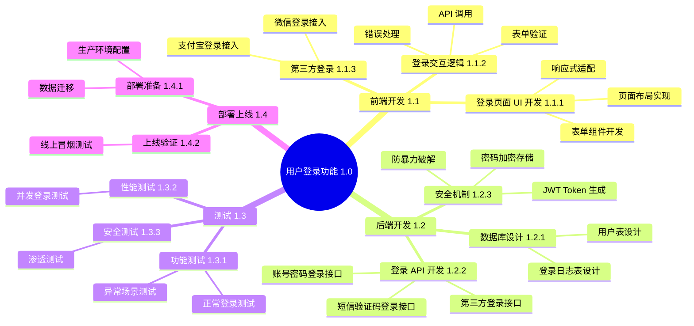
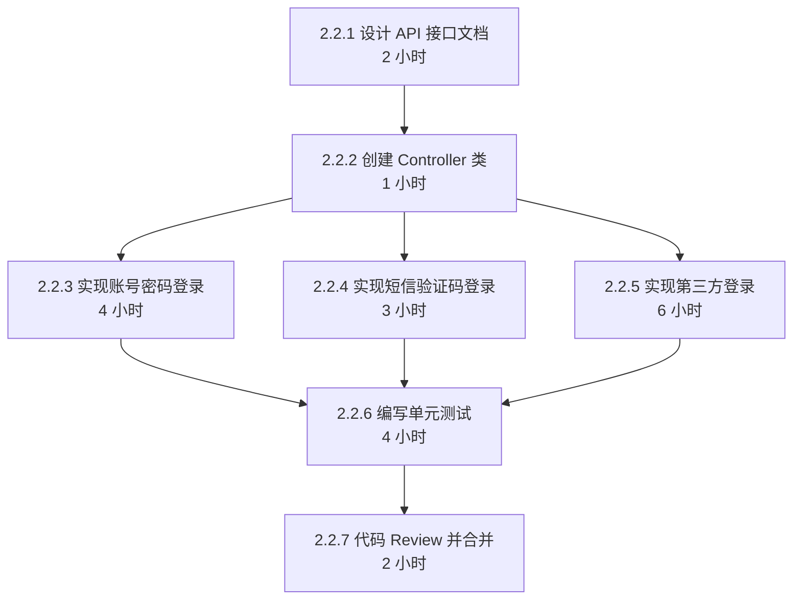
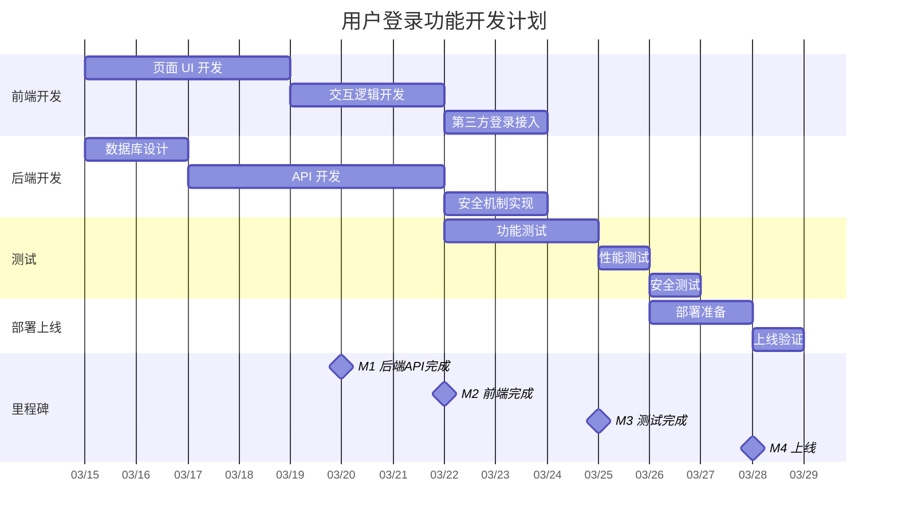

# 完整应用案例：电商平台用户登录功能开发

## 案例背景

| 项目 | 内容 |
|------|------|
| 项目 | 电商平台开发 |
| 任务 | 用户登录功能开发 |
| 周期 | 2 周（3/15 - 3/28） |
| 团队 | 前端 1 人（张三）、后端 1 人（李四）、测试 1 人（王五） |

---

## PDCA 循环概览

```
Plan（规划）→ Do（执行）→ Check（检查）→ Act（改进）
     │
     ├── 阶段一：任务拆解
     ├── 阶段二：规划执行
     ├── 阶段三：验证改进
     └── 阶段四：汇报表达
```

---

## 阶段一：任务拆解（WBS + MECE + RACI）

### 5W2H 边界界定

| 维度 | 内容 |
|------|------|
| **What** | 开发完整的用户登录功能，包括账号密码登录、短信验证码登录、第三方登录（微信、支付宝） |
| **Why** | 支撑电商平台上线，用户认证是核心功能 |
| **Who** | 前端：张三；后端：李四；测试：王五；验收：产品经理赵六 |
| **When** | 3/15 开始，3/28 上线，共 2 周 |
| **Where** | 开发环境 → 测试环境 → 生产环境 |
| **How** | React 前端 + Spring Boot 后端 + MySQL + Redis |
| **How Much** | 3 人 × 2 周 = 6 人周 |

### 最终交付成果

> 一个完整可用的用户登录功能，包括前端登录页面、后端登录 API、数据库设计，通过所有测试并上线。

### WBS 分解树



### RACI 责任分配矩阵

| 工作包 | 前端张三 | 后端李四 | 测试王五 | 产品赵六 | 项目经理 |
|--------|----------|----------|----------|----------|----------|
| 1.1.1 登录页面 UI | **R** | I | C | C | A |
| 1.1.2 登录交互逻辑 | **R** | C | C | I | A |
| 1.1.3 第三方登录前端 | **R** | C | C | C | A |
| 1.2.1 数据库设计 | C | **R** | I | I | A |
| 1.2.2 登录 API | I | **R** | C | I | A |
| 1.2.3 安全机制 | I | **R** | C | I | A |
| 1.3.1 功能测试 | I | C | **R** | I | A |
| 1.3.2 性能测试 | I | C | **R** | I | A |
| 1.3.3 安全测试 | I | C | **R** | I | A |
| 1.4.1 部署准备 | C | **R** | C | I | A |
| 1.4.2 上线验证 | C | C | **R** | C | A |

**角色说明**：
- **R** = Responsible（执行者）
- **A** = Accountable（问责者）
- **C** = Consulted（咨询者）
- **I** = Informed（知情者）

### 关键路径分析

```
关键路径：1.2.1 数据库设计 → 1.2.2 登录 API → 1.1.2 前端联调 → 1.3 测试 → 1.4 上线

路径分析：
路径 1：数据库(2天) → API(5天) → 联调(1天) → 测试(3天) → 上线(2天) = 13 天 ← 关键路径
路径 2：前端 UI(4天) → 交互逻辑(3天) → 第三方登录(2天) = 9 天（可与后端并行）
```

### MECE 检验

| 检验项 | 检验结果 |
|--------|----------|
| 相互独立 | ✅ 各工作包边界清晰，无重叠 |
| 完全穷尽 | ✅ 覆盖开发、测试、部署全流程 |
| 粒度合适 | ✅ 每个活动可在 1-3 天内完成 |
| RACI 正确 | ✅ 每个工作包有唯一 A，至少一个 R |

---

## 阶段二：规划执行（SMART + 诺伊曼思维）

### SMART 目标卡示例（工作包 1.2.2 登录 API 开发）

**工作包信息**：
- WBS 编号：1.2.2
- 负责人（R）：李四
- 问责者（A）：项目经理

| SMART 维度 | 内容 |
|------------|------|
| **S**pecific | 后端开发李四完成登录 API 开发，包括账号密码登录、短信验证码登录、第三方登录三个接口 |
| **M**easurable | 三个接口全部开发完成，通过单元测试，API 响应时间 < 200ms，代码覆盖率 > 80% |
| **A**chievable | 李四有 3 年 Java 开发经验，类似功能开发过 5+ 次，预计需要 5 个工作日 |
| **R**elevant | 登录 API 是用户登录功能的核心，支撑前端登录功能，属于关键路径任务 |
| **T**ime-bound | 3 月 20 日（周三）18:00 前完成 |

**完整表述**：
> 在 3 月 20 日 18:00 前，由后端开发李四完成登录 API 开发（包括账号密码登录、短信验证码登录、第三方登录三个接口），通过单元测试，API 响应时间 < 200ms，该工作支撑用户登录功能整体上线。

### 诺伊曼思维拆解

**工作包 1.2.2 登录 API 开发**的原子步骤：



| 步骤 | 描述 | 前置步骤 | 预计耗时 | 负责人 | 完成标志 |
|------|------|----------|----------|--------|----------|
| 2.2.1 | 设计 API 接口文档 | 2.1 数据库设计完成 | 2 小时 | 李四 | 文档提交并通过评审 |
| 2.2.2 | 创建 Controller 类 | 2.2.1 完成 | 1 小时 | 李四 | 代码编译通过 |
| 2.2.3 | 实现账号密码登录逻辑 | 2.2.2 完成 | 4 小时 | 李四 | 接口测试通过 |
| 2.2.4 | 实现短信验证码登录逻辑 | 2.2.2 完成 | 3 小时 | 李四 | 接口测试通过 |
| 2.2.5 | 实现第三方登录逻辑 | 2.2.2 完成 | 6 小时 | 李四 | 接口测试通过 |
| 2.2.6 | 编写单元测试 | 2.2.3/2.2.4/2.2.5 完成 | 4 小时 | 李四 | 覆盖率 > 80% |
| 2.2.7 | 代码 Review 并合并 | 2.2.6 完成 | 2 小时 | 李四 | MR 合并成功 |

### 优先级管理

**艾森豪威尔矩阵**：

| 象限 | 工作包 | 处理策略 |
|------|--------|----------|
| Q1 重要紧急 | 登录 API 开发、前端联调 | 立即做，优先级最高 |
| Q2 重要不紧急 | 第三方登录接入、文档编写 | 计划做，合理安排 |
| Q3 不重要紧急 | 部分会议、邮件回复 | 授权或减少 |
| Q4 不重要不紧急 | 界面美化、辅助功能 | 本次不做 |

### 执行计划甘特图



---

## 阶段三：验证改进（验证清单 + PDCA）

### 工作包验证（以 1.2.2 登录 API 开发为例）

**验证日期**：3 月 20 日

| 检查项 | 检查结果 | 备注 |
|--------|----------|------|
| **完整性** | | |
| 三个接口都已完成 | ✅ 是 | |
| 单元测试已编写 | ✅ 是 | 覆盖率 85% |
| 代码已合并 | ✅ 是 | MR#123 |
| API 文档已更新 | ✅ 是 | |
| **质量** | | |
| 通过单元测试 | ✅ 是 | |
| 代码 Review 通过 | ✅ 是 | 技术主管 Review |
| 无严重代码异味 | ✅ 是 | |
| **进度** | | |
| 按期完成 | ✅ 是 | 3/20 18:00 前完成 |
| **风险** | | |
| 已识别风险已处理 | ✅ 是 | 第三方登录问题已解决 |
| **遗留问题** | | |
| 无 | | |

**验证结论**：✅ 通过

---

### 项目级验证（上线前）

**验证日期**：3 月 27 日

| 检查项 | 检查结果 | 备注 |
|--------|----------|------|
| **完整性** | | |
| 所有 WBS 工作包完成 | ✅ 是 | 11/11 完成 |
| 所有交付成果提交 | ✅ 是 | 代码、文档、测试报告 |
| **质量** | | |
| 功能测试通过 | ✅ 是 | 50 个测试用例全部通过 |
| 性能测试通过 | ✅ 是 | 并发 1000，响应 < 200ms |
| 安全测试通过 | ✅ 是 | 无高危漏洞 |
| **进度** | | |
| 按计划完成 | ✅ 是 | 提前 1 天 |
| **风险** | | |
| 已识别风险已处理 | ✅ 是 | |
| 无新的高风险问题 | ✅ 是 | |

**验证结论**：✅ 通过，可以上线

---

### 偏差分析与 PDCA

**发现的问题**：

| 问题描述 | 影响程度 | 发生时间 |
|----------|----------|----------|
| 第三方登录接入比预期复杂 | 中 | 3/18 |
| JWT Token 有效期配置问题 | 低 | 3/25 安全测试发现 |

**5 Whys 根因分析（第三方登录问题）**：

```
问题：第三方登录接入延期 1 天

为什么 1？→ 因为接入文档不完善，需要研究源码
为什么 2？→ 因为选型时只看了功能介绍，未深入调研
为什么 3？→ 因为技术评审流程中缺少接入难度评估环节
为什么 4？→ 因为流程模板中没有这项检查
为什么 5？→ 因为流程制定时未考虑第三方服务场景

根本原因：技术评审流程不完善，缺少第三方服务接入评估环节
纠正措施：协调技术专家支援，加班完成
预防措施：更新技术评审流程，增加第三方服务评估清单
```

**PDCA 循环**：

```
Plan：原计划 3/18 完成第三方登录，发现延期风险

Do：
- 协调技术专家支援 1 天
- 加班赶工 2 天
- 调整其他任务优先级

Check：
- 3/20 验证：第三方登录完成
- 整体进度：提前 1 天

Act：
- 短期：记录问题，纳入项目复盘
- 长期：建立《第三方服务接入评估清单》
- 标准化：更新技术评审流程
```

---

### 复盘总结

**回顾目标**：
- 上线时间：3/28
- 功能完成：3 种登录方式
- 性能目标：API 响应 < 200ms

**评估结果**：

| 指标 | 目标值 | 实际值 | 达成情况 |
|------|--------|--------|----------|
| 上线时间 | 3/28 | 3/27 | ✅ 提前 1 天 |
| 功能完成 | 3 种 | 3 种 | ✅ 达成 |
| API 响应 | <200ms | 150ms | ✅ 达成 |
| Bug 数 | <5 | 3 | ✅ 达成 |

**经验总结**：

| 类型 | 内容 |
|------|------|
| **做得好的** | 1. WBS 分解细致，责任明确<br>2. 每日站会及时发现问题<br>3. 测试提前介入，与开发并行 |
| **需改进的** | 1. 第三方服务接入评估不足<br>2. 安全评审应在设计阶段介入<br>3. 文档编写与开发应同步进行 |
| **关键成功因素** | 团队协作紧密、问题响应及时、风险管理到位 |

**知识沉淀**：
- 新建：《第三方服务接入评估清单》
- 更新：《技术评审流程》
- 分享：团队内部分享第三方登录接入经验

---

## 阶段四：汇报表达（金字塔原理 + SCQA）

### 项目完成汇报

---

**汇报主题**：用户登录功能开发完成汇报
**汇报对象**：技术总监、产品经理
**汇报日期**：3 月 29 日
**汇报时长**：15 分钟

---

### 核心结论（结论先行）

> **用户登录功能已按期于 3 月 27 日完成上线，所有功能正常运行，通过全部测试，无严重缺陷。**

---

### SCQA 结构

**S（情境）**：
> 用户登录功能是电商平台的核心功能之一，原计划 3 月 15 日至 3 月 28 日开发，周期 2 周。项目团队包括前端 1 人、后端 1 人、测试 1 人。

**C（冲突）**：
> 开发过程中遇到两个挑战：
> 1. 第三方登录（微信、支付宝）的接入比预期复杂，文档不完善
> 2. 安全测试发现一个 JWT Token 有效期配置问题

**Q（疑问）**：
> 如何确保在保证质量的前提下按期上线？

**A（回答）**：
> 通过以下措施确保上线：
> 1. 协调技术专家支援第三方登录接入
> 2. 安全问题是配置问题，1 小时内修复
> 3. 测试提前介入，与开发并行
> 
> 最终提前 1 天完成上线。

---

### 主要成果（金字塔结构）

```
登录功能成功上线
    │
    ├── 功能完整
    │   ├── 账号密码登录 ✅
    │   ├── 短信验证码登录 ✅
    │   └── 第三方登录（微信、支付宝）✅
    │
    ├── 质量达标
    │   ├── 功能测试 50 用例全通过
    │   ├── 性能测试 响应 150ms（目标 <200ms）
    │   └── 安全测试 无高危漏洞
    │
    └── 按期交付
        ├── 原计划 3/28 上线
        └── 实际 3/27 上线（提前 1 天）
```

### 关键指标达成

| 指标 | 目标值 | 实际值 | 达成率 |
|------|--------|--------|--------|
| 功能完成 | 3 种登录方式 | 3 种登录方式 | 100% |
| 测试通过率 | 100% | 100% | 100% |
| API 响应时间 | <200ms | 150ms | ✅ 超额完成 |
| 安全漏洞 | 0 高危 | 0 高危 | ✅ |
| 上线时间 | 3/28 | 3/27 | 提前 1 天 |

---

### 交付清单

- **代码**：前端 1200 行，后端 800 行，测试用例 50 个
- **文档**：API 文档、数据库设计文档、测试报告
- **配置**：生产环境配置、监控告警配置

---

### 经验总结（程度序列）

**一、做得好的（继续保持）**
1. WBS 分解细致，每个工作包责任明确
2. 每日站会及时发现问题，快速响应
3. 测试提前介入，与开发并行，提高效率

**二、需要改进的（持续优化）**
1. 第三方服务接入应在技术评审阶段深入评估
2. 安全评审应在设计阶段介入，而非测试阶段
3. 文档编写应与开发同步进行

**三、改进措施（已纳入流程）**
1. 建立《第三方服务接入评估清单》
2. 更新技术评审流程，增加安全评估环节
3. 制定文档编写规范，明确同步要求

---

### 后续计划

| 时间 | 事项 | 负责人 |
|------|------|--------|
| 1 周内 | 监控登录成功率、响应时间 | 李四 |
| 2 周内 | 根据用户反馈优化登录体验 | 张三 |
| 下迭代 | 增加人脸识别登录 | 产品规划 |

---

### 决策请求

□ 确认项目结项
□ 确认后续迭代规划
□ 其他意见：_______

---

## 案例总结

本案例完整展示了 task-master 技能的四个阶段与 PDCA 循环：

```
┌─────────────────────────────────────────────────────────────┐
│                      PDCA 持续改进循环                        │
│                                                              │
│  Plan（规划）→ Do（执行）→ Check（检查）→ Act（改进）       │
│      │             │             │             │            │
│      ▼             ▼             ▼             ▼            │
│  阶段一：拆解   阶段二：执行   阶段三：验证   阶段四：汇报   │
│  WBS+MECE      SMART+诺伊曼   验证清单+PDCA  金字塔+SCQA    │
│  +RACI         +优先级管理    +5 Whys        +TOPS         │
└─────────────────────────────────────────────────────────────┘
```

**方法工具应用统计**：

| 方法论 | 应用场景 | 效果 |
|--------|----------|------|
| WBS | 任务分解 | 11 个工作包，结构清晰 |
| MECE | 检验完整性 | 无遗漏、无重叠 |
| RACI | 责任分配 | 责任明确，无推诿 |
| SMART | 目标设定 | 目标清晰可衡量 |
| 诺伊曼思维 | 步骤拆解 | 22 个原子步骤 |
| 艾森豪威尔矩阵 | 优先级管理 | 重点突出 |
| 验证清单 | 质量把关 | 3 级验证，质量达标 |
| 5 Whys | 根因分析 | 找到根本原因 |
| PDCA | 持续改进 | 螺旋上升 |
| 金字塔原理 | 汇报结构 | 结论先行，逻辑清晰 |
| SCQA | 故事框架 | 引人入胜 |

**成果**：
- ✅ 提前 1 天上线
- ✅ 功能 100% 完成
- ✅ 质量 100% 达标
- ✅ 经验已沉淀为可复用知识

通过这套系统化的方法论，确保项目高质量完成，并为后续项目积累了宝贵经验。
